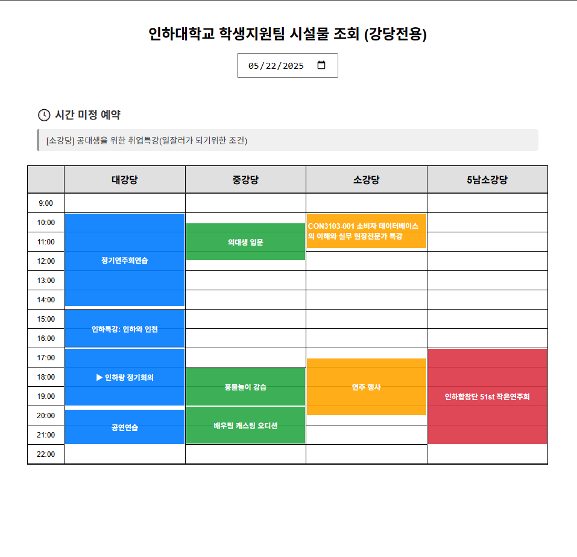

# InhaGianHub

[영문버전 문서](./README.md)

인하대학교 시설물 예약 정보를 하나의 사이트에서 확인할 수 있는 서비스입니다.

[서비스 바로가기](https://inhagianhub-14f8d.web.app/)

## 목차

-   [프로젝트 소개](#프로젝트-소개)
-   [시작하기 (로컬 개발)](#시작하기-로컬-개발)
-   [배포](#배포)
-   [기여 및 라이선스](#기여-및-라이선스)

---

## 프로젝트 소개

**InhaGianHub**는 인하대학교 학생지원팀에서 관리하는 강의실 및 강당(본관 대강당, 본관 중강당, 본관 소강당, 5남 소강당)의 예약 현황을 한 화면에서 시각적으로 확인할 수 있도록 지원하는 웹 서비스입니다.



---

## 시작하기 (로컬 개발)

### 1. 환경 설정

`.env` 파일을 루트 디렉토리에 생성하고 아래와 같이 Firebase 인증 정보를 입력합니다.

```env
FIREBASE_CREDENTIALS={...}  # Firebase 서비스 계정 JSON 문자열 또는 base64 인코딩
```

`.env` 파일은 Git에 포함되지 않도록 `.gitignore`에 등록해야 합니다.

Firebase 서비스 계정 키는 Firebase Console의 `프로젝트 설정 > 서비스 계정`에서 생성할 수 있습니다.

### 2. Docker를 이용한 실행

Docker가 설치된 경우, 다음 명령어로 백엔드와 프론트엔드를 함께 실행할 수 있습니다.

```bash
docker-compose up --build
```

접속 주소:

-   백엔드 API: [http://localhost:8000](http://localhost:8000)
-   프론트엔드: 브라우저에서 자동 확인 가능

종료 시에는 다음 명령어를 실행합니다.

```bash
docker-compose down
```

### 3. 수동 실행 (Docker 미사용 시)

백엔드 실행:

```bash
cd backend
pip install -r requirements.txt
uvicorn main:app --reload --host 0.0.0.0 --port 8000
```

프론트엔드 실행:

```bash
cd frontend
yarn install
yarn dev
```

---

## 배포

### 프론트엔드 배포

1. Firebase CLI 로그인

```bash
firebase login
```

2. 프로젝트 초기화 (처음 한 번만)

```bash
firebase init
```

3. 환경 변수 설정 (`.env` 또는 `.env.production`)

```env
VITE_API_BASE_URL=https://your-cloudrun-backend.a.run.app
```

4. 프로젝트 빌드

```bash
yarn build
```

5. Firebase에 배포

```bash
firebase deploy
```

### 백엔드 배포 (Google Cloud Run)

1. Secret Manager에 Firebase 자격 정보 업로드

```bash
gcloud secrets create firebase-credentials \
  --data-file=firebase_credentials.json
```

2. Cloud Run 서비스 계정에 권한 부여

```bash
gcloud projects add-iam-policy-binding <PROJECT_ID> \
  --member="serviceAccount:<PROJECT_NUMBER>-compute@developer.gserviceaccount.com" \
  --role="roles/secretmanager.secretAccessor"
```

3. Docker 이미지 빌드 및 푸시

```bash
docker build -t gcr.io/<PROJECT_ID>/fastapi-app .
docker push gcr.io/<PROJECT_ID>/fastapi-app
```

4. Cloud Run에 배포 (환경 변수 및 시크릿 포함)

```bash
gcloud run deploy inhagianhubapi \
  --image gcr.io/<PROJECT_ID>/fastapi-app \
  --platform managed \
  --port 8080 \
  --region asia-northeast3 \
  --allow-unauthenticated \
  --set-env-vars FRONTEND_ORIGIN=https://inhagianhub-14f8d.web.app \
  --set-secrets FIREBASE_CREDENTIALS=firebase-credentials:latest
```

---

## 기여 및 라이선스

### 기여 방법

기여를 원하시는 분은 [CONTRIBUTING.md](./CONTRIBUTING.md)를 참고해 주세요.

### 라이선스

이 프로젝트는 Apache License 2.0을 따릅니다.
자유롭게 사용, 수정, 배포가 가능하며 자세한 내용은 [LICENSE](./LICENSE) 파일을 참조하세요.
