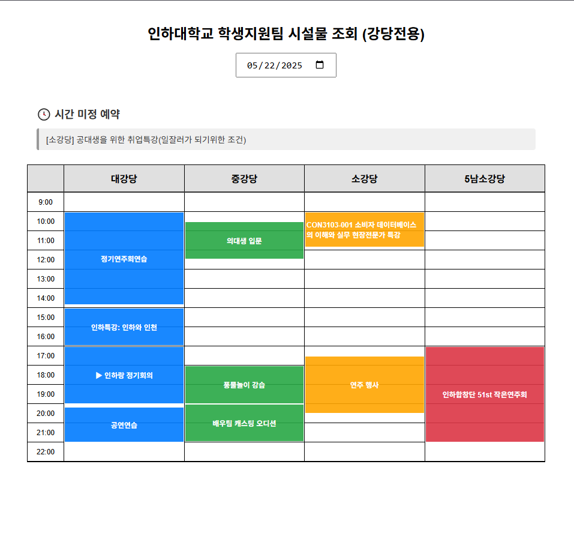

# InhaGianHub

[Korea Document](./README.ko.md)

A unified platform to view reservation status for Inha University facilities in one place.

[Go to Service](https://inhagianhub-14f8d.web.app/)

## Table of Contents

-   [Project Overview](#project-overview)
-   [Getting Started (Local Development)](#getting-started-local-development)
-   [Deployment](#deployment)
-   [Contributing and License](#contributing-and-license)

---

## Project Overview

**InhaGianHub** is a web service that visually displays the reservation status of various lecture halls and auditoriums managed by the Student Support Team at Inha University (Main Auditorium, Medium Auditorium, Small Auditorium, and 5th South Small Auditorium).



---

## Getting Started (Local Development)

### 1. Environment Setup

Create a `.env` file in the project root and add your Firebase credentials as shown:

```env
FIREBASE_CREDENTIALS={...}  # JSON string or base64 encoded
```

Make sure to add `.env` to `.gitignore` to prevent it from being committed to the repository.

You can generate a Firebase service account key from `Project Settings > Service Accounts` in the Firebase Console.

### 2. Run with Docker

If Docker is installed, you can run both the backend and frontend with:

```bash
docker-compose up --build
```

Access:

-   Backend API: [http://localhost:8000](http://localhost:8000)
-   Frontend: accessible in the browser

To stop:

```bash
docker-compose down
```

### 3. Manual Run (Without Docker)

**Backend:**

```bash
cd backend
pip install -r requirements.txt
uvicorn main:app --reload --host 0.0.0.0 --port 8000
```

**Frontend:**

```bash
cd frontend
yarn install
yarn dev
```

---

## Deployment

### Frontend Deployment

1. Login to Firebase CLI

```bash
firebase login
```

2. Initialize the project (only once)

```bash
firebase init
```

3. Set environment variables (`.env` or `.env.production`)

```env
VITE_API_BASE_URL=https://your-cloudrun-backend.a.run.app
```

4. Build the frontend

```bash
yarn build
```

5. Deploy to Firebase

```bash
firebase deploy
```

### Backend Deployment (Google Cloud Run)

1. Upload Firebase credentials to Secret Manager

```bash
gcloud secrets create firebase-credentials \
  --data-file=firebase_credentials.json
```

2. Grant Cloud Run service account access to the secret

```bash
gcloud projects add-iam-policy-binding <PROJECT_ID> \
  --member="serviceAccount:<PROJECT_NUMBER>-compute@developer.gserviceaccount.com" \
  --role="roles/secretmanager.secretAccessor"
```

3. Build and push Docker image

```bash
docker build -t gcr.io/<PROJECT_ID>/fastapi-app .
docker push gcr.io/<PROJECT_ID>/fastapi-app
```

4. Deploy to Cloud Run with environment variables and secret

```bash
gcloud run deploy inhagianhubapi \
  --image gcr.io/<PROJECT_ID>/fastapi-app \
  --platform managed \
  --port 8080 \
  --region asia-northeast3 \
  --allow-unauthenticated \
  --set-env-vars FRONTEND_ORIGIN=https://inhagianhub-14f8d.web.app \
  --set-secrets FIREBASE_CREDENTIALS=firebase-credentials:latest
```

---

## Contributing and License

### Contributing

To contribute, please refer to [CONTRIBUTING.md](./CONTRIBUTING.md).

### License

This project is licensed under the Apache License 2.0.
You are free to use, modify, and distribute it. For more information, see the [LICENSE](./LICENSE) file.
